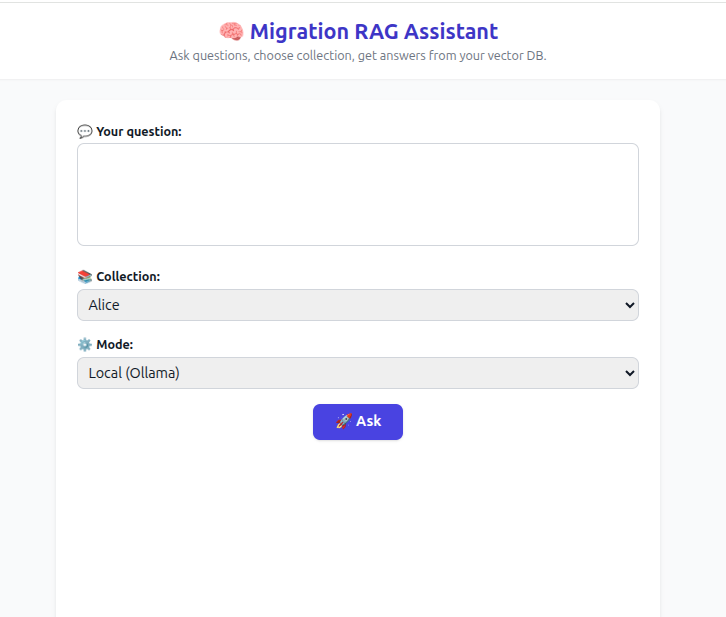
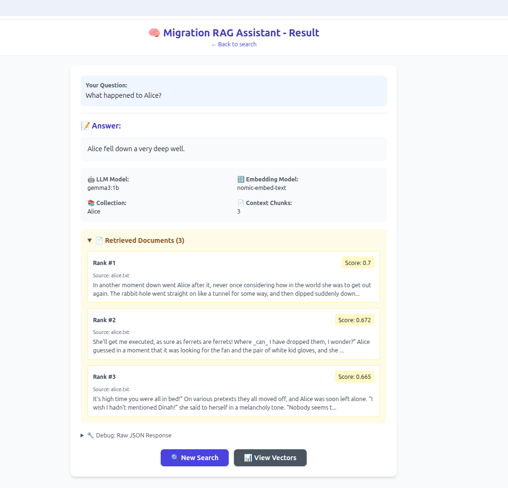

# 🧠 Migration RAG Assistant

A lightweight yet powerful **Retrieval-Augmented Generation (RAG)** system built with **FastAPI**, **Ollama**, and **Qdrant** — including a simple web interface for asking questions and viewing results.

---

## 🚀 Overview

This project connects a local language model with a vector database to build a working RAG pipeline.  
You can upload your text files, index them into Qdrant, and then ask natural-language questions.  
The system finds the most relevant chunks, builds a context, and lets the LLM generate the final answer.

---

## ✨ Features

- 🔍 **Semantic Search** powered by Qdrant  
- 💬 **Context-aware answers** using local LLMs (via Ollama)  
- 🧩 **Full RAG pipeline** — embeddings, retrieval, generation  
- 🧱 **FastAPI backend + HTML UI** (Jinja2 templates)  
- 📦 **Docker-ready setup**  
- 🧾 **Document uploader** with automatic text chunking  

---

## ⚙️ Tech Stack

| Layer | Tool |
|-------|------|
| Backend | FastAPI |
| Vector DB | Qdrant |
| LLM Engine | Ollama |
| Data Models | Pydantic |
| Async HTTP | httpx |
| Frontend | Jinja2 Templates |
| Containers | Docker Compose |

---

## 📁 Project Structure

## 🖼️ Screenshots

### Main Interface

### Example Answer

